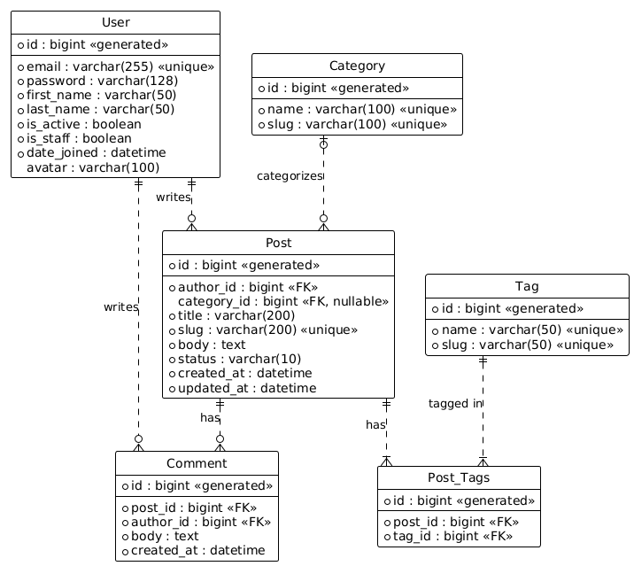

# Blog API
This repository is dedicated for project from "Advanced Django" subject in KBTU university.

## Setup
1. `pip install -r requirements/dev.txt`
2. `cp settings/.env.example settings/.env` (and fill it in)
3. `python manage.py migrate`
4. `python manage.py runserver`

## ERD

## Features
- JWT Auth
- Redis Caching & Throttling
- Pub/Sub for comments

