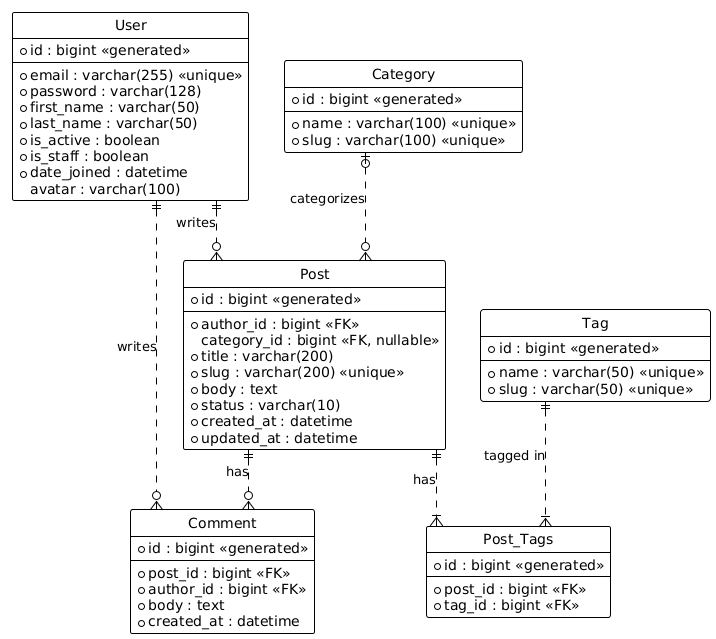

# Blog API
This repository is dedicated for project from Advanced Django subject in KBTU university.

## Setup
1. `pip install -r requirements/dev.txt`
2. `cp settings/.env.example settings/.env` (and fill it in)
3. `python manage.py migrate`
4. `python manage.py runserver`

## ERD

## Features
- JWT Auth
- Redis Caching & Throttling
- Pub/Sub for comments

## Verification Steps

Start everything: 'docker compose up --build'

| Check | Command | Expected result |
|---|---|---|
| nginx serving admin | 'curl -I http://localhost/admin/login/' | '200 OK' with 'Server: nginx/...'. |
| Static cache headers | 'curl -I http://localhost/static/admin/css/base.css' | '200 OK' with a long 'Cache-Control: max-age=...' header. |
| API works | 'curl http://localhost/api/posts/' | JSON list of posts. |
| 502 when web is down | 'docker compose stop web' then 'curl -I http://localhost/api/posts/' | '502 Bad Gateway' returned by nginx, not connection refused. Restart 'web' afterwards. |
| Port 8000 blocked | 'curl http://localhost:8000/' | Connection refused. |
| WebSocket upgrade | 'wscat -c "ws://localhost/ws/posts/<existing-slug>/comments/?token=<jwt>"' | Confirm '101 Switching Protocols', post a comment via the REST API, see the WS message arrive. |
